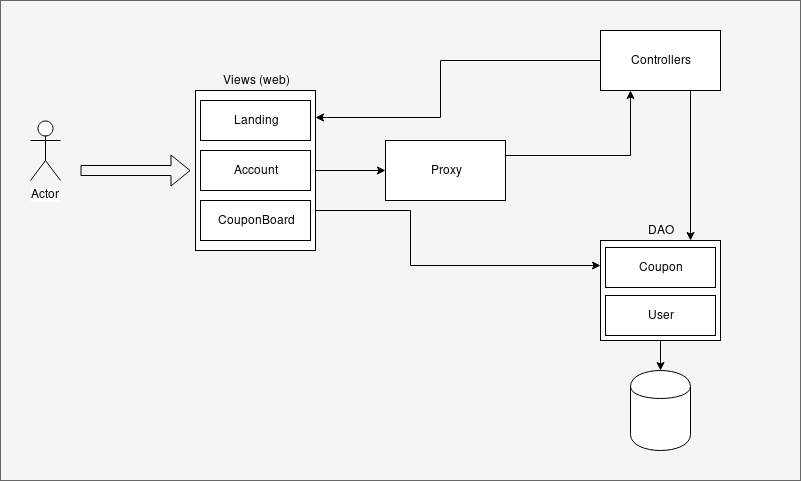
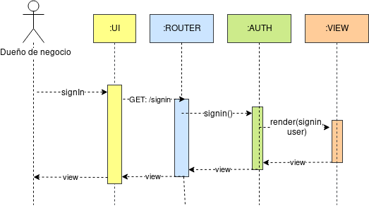

# Introduction

# Features

- **landing:** Renderiza el landing page
- **signIn:** Renderiza la vista de acceso
- **postSignIn:** Recibe un JSON con las credenciales de un usuario y redirecciona al board
- **signOut:** Deslogea la sesion actual y redirecciona al landing page
- **signUp:** Renderiza la vista de registro
- **postSignUp:** Recibe un JSON con el formulario de registro de un usuario, crea el usuario y redirecciona a la vista de signIn
- **getCoupons:** Retorna un JSON con todos los cupones actuales de todas las empresas
- **changePassword (*):** Renderiza la vista para cambiar contraseña
- **postChangePassword (*):** Recibe un JSON con la antigua y nueva contraseña de la sesión actual y la actualiza y redirecciona al board
- **board (*):** Renderiza una vista con los cupones de la sesión actual
- **addCoupon (*):** Recibe un JSON con un nuevo cupón a agregar y lo agrega
- **deleteCoupon (*):** Recibe un JSON con un id de un copón a eliminar y lo elimina
- **editCoupon (*):** Recibe un JSON con la nueva información de un cupón y la actualiza

**Nota:** Los features con (*) requieren que el usuario este logeado

# Design

- Architecture diagram

    
    
- Class diagram

    

- Sequence SignIn

    

- Sequence PostSignIn

    

- Sequence PostSignUp

    

# Code Structure

- **/YapeCopones**
- -- **/model**
- ------ User.java
- ------ Coupon.java
- -- **/views**
- ------ Template.hbs
- ------ Landing.hbs
- ------ LogIn.hbs
- ------ LogUp.hbs
- ------ ChangePassword.hbs
- ------ Board.hbs
- -- **/controllers**
- ------ Landing.java
- ------ Auth.java
- ------ Coupon.java
- -- Router.java
- -- Main.java
- ----------------
- **/Yape
- -- **/views
- ------ Landing.java
- ------ Coupon.java

# FAQ

# Glossary