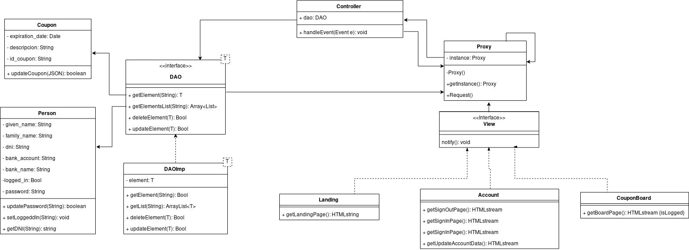
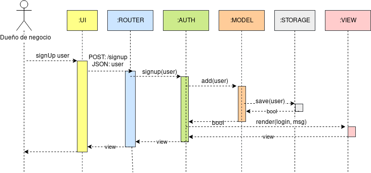

# Introduction
El proyecto propone brindar a los usuarios de Yape los mejores descuentos en un solo lugar y a los restaurantes, las facilidades para promocionar su negocio mediante cupones de descuento en Yape.

YapeCupones existe fuera del aplicativo Yape. Sin embargo, el usuario debe contar con Yape para entrar a YapeCupones y el restaurante debe ser un YapeNegocio para registrarse.

El mercado de jóvenes que comen fuera de casa y tienen el perfil de Yapero es de 1,1 millones en Lima. 

# Features

- **landing:** Renderiza el landing page
- **signIn:** Renderiza la vista de acceso
- **postSignIn:** Recibe un JSON con las credenciales de un usuario y redirecciona al board
- **signOut:** Deslogea la sesion actual y redirecciona al landing page
- **signUp:** Renderiza la vista de registro
- **postSignUp:** Recibe un JSON con el formulario de registro de un usuario, crea el usuario y redirecciona a la vista de signIn
- **getCoupons:** Retorna un JSON con todos los cupones actuales de todas las empresas
- **changePassword (*):** Renderiza la vista para cambiar contraseña
- **postChangePassword (*):** Recibe un JSON con la antigua y nueva contraseña de la sesión actual y la actualiza y redirecciona al board
- **board (*):** Renderiza una vista con los cupones de la sesión actual
- **addCoupon (*):** Recibe un JSON con un nuevo cupón a agregar y lo agrega
- **deleteCoupon (*):** Recibe un JSON con un id de un copón a eliminar y lo elimina
- **editCoupon (*):** Recibe un JSON con la nueva información de un cupón y la actualiza

**Nota:** Los features con (*) requieren que el usuario este logeado

# Design

- Architecture diagram

    
    
- Class diagram

    

- Sequence SignIn

    

- Sequence PostSignIn

    

- Sequence PostSignUp

    

# Code Structure

- **/YapeCupones**
- -- **/model**
- ------ User.java
- ------ Coupon.java
- -- **/views**
- ------ Template.hbs
- ------ Landing.hbs
- ------ LogIn.hbs
- ------ LogUp.hbs
- ------ ChangePassword.hbs
- ------ Board.hbs
- -- **/controllers**
- ------ Landing.java
- ------ Auth.java
- ------ Coupon.java
- -- Router.java
- -- Main.java
- ----------------
- **/Yape**
- -- **/views**
- ------ Landing.java
- ------ Coupon.java

# FAQ
	- ¿Por qué realizar una aplicación con Java?
	Java es un lengauge de programación de propósito general que es multiplataforma y orientado objetos. Esto permite que el código funcione en cualquier dispositivo y que el código sea reutilizable.	Además  ofrece manejo automático de la memoria y cuyos objetos no hacen referencia a datos fuera de sí mismos o de otros objetos de Java.

# Glossary
	- Ticket: Precio de un almuerzo o menú.
	- Restaurante: Establecimiento en el que se preparan y sirven comidas. Nos enfocamos en restaurantes cercanos al centro laboral y de estudios con un ticket promedio menor a S/.20 por menú o almuerzo.
	- Yape: Sistema creado por el BCP que permite hacer transferencias usando el número de celular.
	- YapePoints: Plataforma web (disponible en móvil) sincronizada con Yape que permite a un Yapero encontrar los mejores descuentos y a un restaurante administrar información de los cupones que ofrece y de pagos hechos con Yape en su negocio.
	- Yapero: Usuario de Yape.
	- YapeMaster: Aplicación para la gestión de cupones para los restaurantes.

