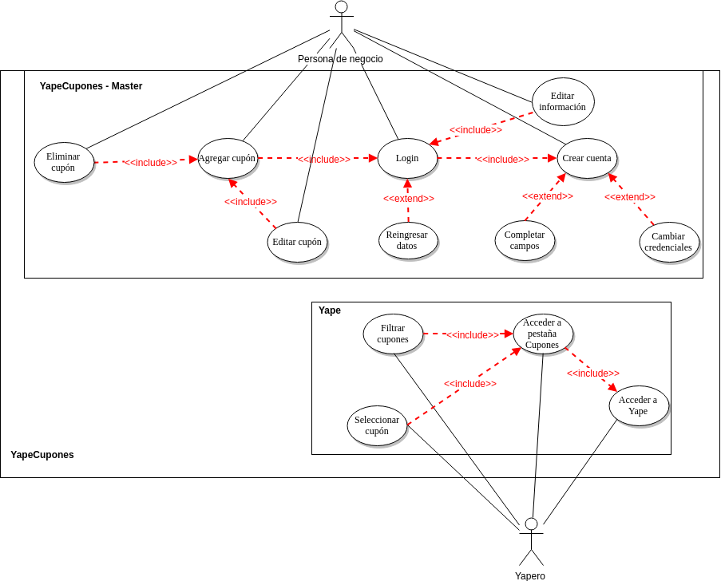

# Introduction

El proyecto propone brindar a los usuarios de Yape los mejores descuentos en un solo lugar y a los restaurantes, las facilidades para promocionar su negocio mediante cupones de descuento en Yape.

YapeCupones existe fuera del aplicativo Yape. Sin embargo, el usuario debe contar con Yape para entrar a YapeCupones y el restaurante debe ser un YapeNegocio para registrarse.

El mercado de jóvenes que comen fuera de casa y tienen el perfil de Yapero es de 1,1 millones en Lima. 

# Requirements
## Functional:
* Sincronización entre YapeMaster y YapeCupones.
* YapeMaster: Agregar, editar y eliminar cupones.
* YapeCupones: Buscar y filtrar cupones.
* Autenticación de cuentas con Yape-BCP.
## Non-Functional:
* Usabilidad: la plataforma debe ser compatible con todos los dispositivos móviles que soporten previamente el uso de Yape.
* Manejabilidad: la plataforma debe tener una interfaz sencilla, similar a la de Yape, para no confundir a los usuarios.
* Performance: la plataforma debe ser capaz de brindar la información a los usuarios en un tiempo efectivo (debe ser tan o más rápida que Yape).
* Seguridad: la plataforma debe garantizar la integridad de la información de los usuarios.
* Escalabilidad: la plataforma debe soportar una gran cantidad de cupones a la vez, sin comprometer la vista que tienen los usuarios.
* Interoperabilidad: la plataforma debe funcionar como un complemento de Yape, no como un servicio independiente.

# Features
* Yaperos, filtrar cupones: **filtrar**.
* Restaurantes, agregar promoción: **agregar**.
* Restaurantes, editar promoción: **modificar**.
* Restaurantes, eliminar promoción: **eliminar**.

# FAQ
- ¿Desde que dispositivos puedo acceder a YapeMaster?
  Es una aplicación web y solo necesitas de un navegador web en tu computadora o celular.

# Glossary
* Ticket: Precio de un almuerzo o menú.
* Restaurante: Establecimiento en el que se preparan y sirven comidas. Nos enfocamos en restaurantes cercanos al centro laboral y de estudios con un ticket promedio menor a S/.20 por menú o almuerzo.
* Yape: Sistema creado por el BCP que permite hacer transferencias usando el número de celular.
* YapeCupones: Plataforma web (disponible en móvil) sincronizada con Yape que permite a un Yapero encontrar los mejores descuentos y a un restaurante administrar información de los cupones que ofrece y de pagos hechos con Yape en su negocio.
* Yapero: Usuario de Yape.

# Anexo A (User Stories and Use Cases).
### User Stories:
https://github.com/cs2901/yape-bcp-project-yapepoints/issues

### Use Cases:
**System** YapeCupones  
**Actor** Personal de negocio
**Use Case** UC-01 Crear cuenta  
**MMS**     
1. El usuario entra a la web de YapeCupones  
1. El usuario hace click en Registrarse como Restaurante  
1. El sistema redirecciona a un formulario 
1. El usuario completa el formulario
1. El sistema solicita confirmación de la data ingresada
1. El sistema crea la cuenta en YapeCupones y redirecciona a una vista de Log in

**Extentions**      
5. El sistema detecta que hay campos sin completar  
* Solicita que complete todos los campos
6. El sistema detecta que ya hay un usuario registrado con la información ingresada  
* Redirecciona al formulario

**System** YapeCupones  
**Actor** Personal de negocio
**Use Case** UC-02 Log in  
**MMS**     
1. El usuario entra a la web de YapeCupones  
1. El usuario hace click en Log in  
1. El sistema redirecciona a un formulario 
1. El usuario completa el formulario con usuario y contraseña
1. El sistema valida los datos ingresados.
1. El usuario accede.

**Extentions**      
5. El sistema detecta que el usuario o contraseña ingresados no coinciden.
* Solicita que vuelva a completar los campos.

**System** YapeCupones    
**Actor** Personal de negocio  
**Use Case** UC-02 Agregar una nueva promoción  
**Preconditions** UC-01, Estar logueado  
**MMS**  
1. El usuario con acceso selecciona la opción Agregar Cupón.
1. El usuario carga una imagen (personalizada o predeterminada).
1. El usuario le pone nombre al cupón.
1. El usuario describe la promoción.
1. El usuario llena un formulario con parámetros de la promoción (stock, fecha, requisitos).
1. El usuario da click en publicar.
1. El sistema le muestra al usuario su cupón publicado.  

**System** YapeCupones    
**Actor** Personal de negocio  
**Use Case** UC-03 Editar cupón.  
**Preconditions** UC-02  
**MMS**    
1. El usuario selecciona la vista de cupones.
1. El usuario selecciona el cupón que desea editar.
1. Edita el cupón.
1. Guarda los cambios.

**System** YapeCupones    
**Actor** Personal de negocio  
**Use Case** UC-04 Eliminar promoción  
**Preconditions** UC-02  
**MMS**  
1. El propietario selecciona el cupón que desea eliminar.
1. El propietario selecciona la opción ***Eliminar Cupón***
1. El sistema le pide al usuario confirmar la acción.
1. El sistema elimina el cupón.

**System** YapeCupones  
**Actor** Usuario de Yape  
**Use Case** UC-05 Acceder a pestaña Cupones  
**Preconditions** Estar logueado a Yape  
**MMS**  
1. Hacer click en el menú de opciones de Yape.
1. Hacer click en cupones.

**System** YapeCupones  
**Actor** Usuario de Yape  
**Use Case** UC-06 Selecciona un cupón  
**Preconditions** UC-05, el usuario está logueado.  
**MMS**  
1. El usuario hace click a la pestaña YapeCupones.
1. El usuario busca un cupón en la vista principal con los filtros que necesite.
1. El usuario ve un cupón que le interesa
1. El usuario selecciona ver dirección

**System** YapeCupones  
**Actor** Usuario de Yape  
**Use Case** UC-07 Usuario quiere filtrar cupones.  
**Preconditions** UC-05, el usuario está logueado.  
**MMS**  
1. El usuario ingresa a la app de Yape y selecciona la pestaña YapeCupones.
1. El usuario selecciona un distrito.
1. La aplicación muestra los cupones.

Diagrama de los Use Cases:

