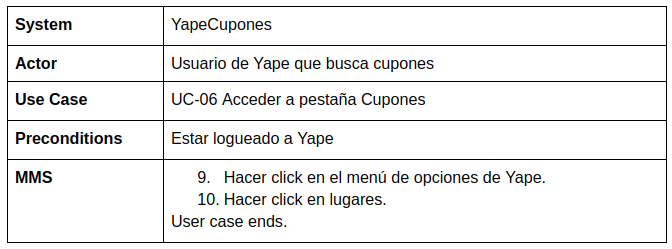
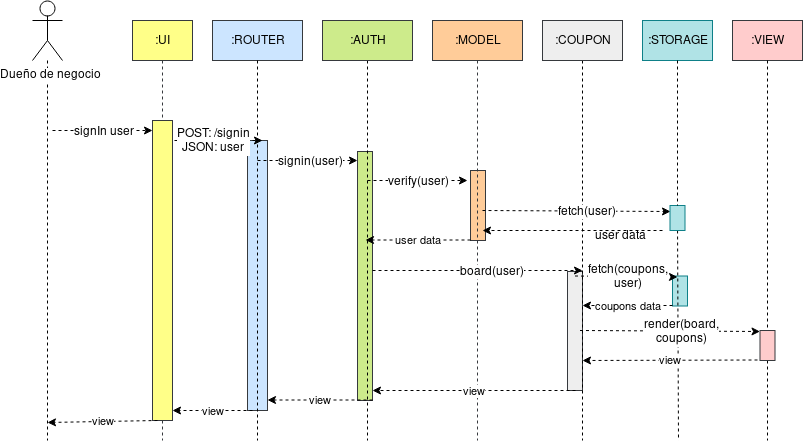

# Introduction

El proyecto propone brindar a los usuarios de Yape los mejores descuentos en un solo lugar y a los restaurantes, las facilidades para promocionar su negocio mediante cupones de descuento en Yape.

YapeCupones existe fuera del aplicativo Yape. Sin embargo, el usuario debe contar con Yape para entrar a YapeCupones y el restaurante debe ser un Yape Negocio para registrarse.

El mercado de jóvenes que comen fuera de casa y tienen el perfil de Yapero es de 1,1 millones en Lima.

### Pueden ver nuestra pagina entrando al siguiente link:
http://142.93.160.192/

# Requirements
## Functional:
* Sincronización entre YapeUser y YapeCupones.
* YapeCupones: Agregar, editar y eliminar cupones.
* YapeCupones: Recuperar contraseña.
* YapeCupones: Agregar la ubicación del establecimiento.
* YapeUser: Visualización de los cupones.
* YapeUser: Filtrado de los cupones por distrito.
* YapeUser: Visualizar en GoogleMaps la ubicación de los establecimientos.

## Non-Functional:
* Usabilidad: la plataforma debe ser compatible con todos los dispositivos móviles que soporten previamente el uso de Yape.
* Manejabilidad: la plataforma debe tener una interfaz sencilla, similar a la de Yape, para no confundir a los usuarios.
* Performance: la plataforma debe ser capaz de brindar la información a los usuarios en un tiempo efectivo (debe ser tan o más rápida que Yape).
* Seguridad: la plataforma debe garantizar la integridad de la información de los usuarios.
* Escalabilidad: la plataforma debe soportar una gran cantidad de cupones a la vez, sin comprometer la vista que tienen los usuarios.
* Interoperabilidad: la plataforma debe funcionar como un complemento de Yape, no como un servicio independiente.

# Features
* Yaperos, filtrar cupones: **filtrar**.
* Restaurantes, agregar promoción: **agregar**.
* Restaurantes, editar promoción: **modificar**.
* Restaurantes, eliminar promoción: **eliminar**.

# FAQ
- ¿Desde que dispositivos puedo acceder a YapeMaster?
  Es una aplicación web y solo necesitas de un navegador web en tu computadora o celular.

# Glossary
* Ticket: Precio de un almuerzo o menú.
* Restaurante: Establecimiento en el que se preparan y sirven comidas. Nos enfocamos en restaurantes cercanos al centro laboral y de estudios con un ticket promedio menor a S/.20 por menú o almuerzo.
* Yape: Sistema creado por el BCP que permite hacer transferencias usando el número de celular.
* YapeUser: Plataforma móvil implementada con Yape que permite a un Yapero visualizar los cupones.
* Yapero: Usuario de Yape.
* Yape Cupones: Plataforma web para la gestión de cupones para los restaurantes.
* Yape Negocio: Un negocio que está afiliado a Yape para usarlo como medio de pago.

# Anexo A (User Stories and Use Cases).
### User Stories:
https://github.com/cs2901/yape-bcp-project-yapepoints/issues

### Use Cases:

## Diagrama de los Use Cases:

## Diagramas de secuencia:

- Sequence SignIn

    

- Sequence PostSignIn

    

- Sequence PostSignUp

    

